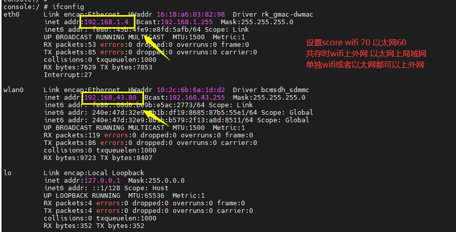

## android 10 wifi以太网共存
wifi上局域网，以太网上外网，只能这样，测试同时打开，先打开以太网再打开wifi，或者先打开wifi再打开以太网都可以同时获取IP
wifi测试连接手机热点，笔记本再连接wifi热点测试局域网连接，以太网直接接路由ping外网
### 补丁
```
diff --git a/service/java/com/android/server/wifi/WifiNetworkFactory.java b/service/java/com/android/server/wifi/WifiNetworkFactory.java
index 4b5866b..7a1495e 100644
--- a/service/java/com/android/server/wifi/WifiNetworkFactory.java
+++ b/service/java/com/android/server/wifi/WifiNetworkFactory.java
@@ -80,7 +80,7 @@ import java.util.Set;
public class WifiNetworkFactory extends NetworkFactory {
private static final String TAG = "WifiNetworkFactory";
@VisibleForTesting
- private static final int SCORE_FILTER = 60;
+ private static final int SCORE_FILTER = 80;
@VisibleForTesting
public static final int CACHED_SCAN_RESULTS_MAX_AGE_IN_MILLIS = 20 * 1000; // 20 seconds
@VisibleForTesting


diff --git a/java/com/android/server/ethernet/EthernetNetworkFactory.java b/java/com/android/server/ethernet/EthernetNetworkFactory.java
index f70e885..8d9f17c 100644
--- a/java/com/android/server/ethernet/EthernetNetworkFactory.java
+++ b/java/com/android/server/ethernet/EthernetNetworkFactory.java
@@ -395,7 +395,7 @@ public class EthernetNetworkFactory extends NetworkFactory {
new TransportInfo(ConnectivityManager.TYPE_BLUETOOTH, 69));
// WifiNetworkFactory.SCORE_FILTER / NetworkAgent.WIFI_BASE_SCORE
sTransports.put(NetworkCapabilities.TRANSPORT_WIFI,
- new TransportInfo(ConnectivityManager.TYPE_WIFI, 60));
+ new TransportInfo(ConnectivityManager.TYPE_WIFI, 80));
// TelephonyNetworkFactory.TELEPHONY_NETWORK_SCORE
sTransports.put(NetworkCapabilities.TRANSPORT_CELLULAR,
new TransportInfo(ConnectivityManager.TYPE_MOBILE, 50));


diff --git a/services/core/java/com/android/server/ConnectivityService.java b/services/core/java/com/android/server/ConnectivityService.java
index e5fddef..8758252 100644
--- a/services/core/java/com/android/server/ConnectivityService.java
+++ b/services/core/java/com/android/server/ConnectivityService.java
@@ -238,11 +238,13 @@ public class ConnectivityService extends IConnectivityManager.Stub
private static final String REQUEST_ARG = "requests";

private static final boolean DBG = true;
- private static final boolean DDBG = Log.isLoggable(TAG, Log.DEBUG);
- private static final boolean VDBG = Log.isLoggable(TAG, Log.VERBOSE);
+ private static final boolean DDBG = true;//Log.isLoggable(TAG, Log.DEBUG);
+ private static final boolean VDBG = true;//Log.isLoggable(TAG, Log.VERBOSE);

private static final boolean LOGD_BLOCKED_NETWORKINFO = true;

+ private static final boolean ENABLE_NETWORK_COEXIST = true;
+
/**
* Default URL to use for {@link #getCaptivePortalServerUrl()}. This should not be changed
* by OEMs for configuration purposes, as this value is overridden by
@@ -6108,7 +6110,23 @@ public class ConnectivityService extends IConnectivityManager.Stub
break;
}
}
- nai.asyncChannel.disconnect();
+ if (ENABLE_NETWORK_COEXIST) {
+ log("Skip teardownUnneededNetwork: " + nai.name ());
+ if(nai.getCurrentScore()>0){
+ try{
+ mNMS.removeInterfaceFromNetwork(nai.linkProperties.getInterfaceName(),
+nai.network.netId);
+ mNMS.addInterfaceToLocalNetwork(nai.linkProperties.getInterfaceName(),
+nai.linkProperties.getRoutes());
+ mLegacyTypeTracker.add(nai.networkInfo.getType(),nai);
+ }catch(RemoteException e){
+ Log.e(TAG,"Faided to add iface to local network" + e);
+ }
+ }
+
+ }else{
+ nai.asyncChannel.disconnect();
+ }
}
```
## 测试
wifi连手机热点，以太网连路由，不在同一个网段测试



